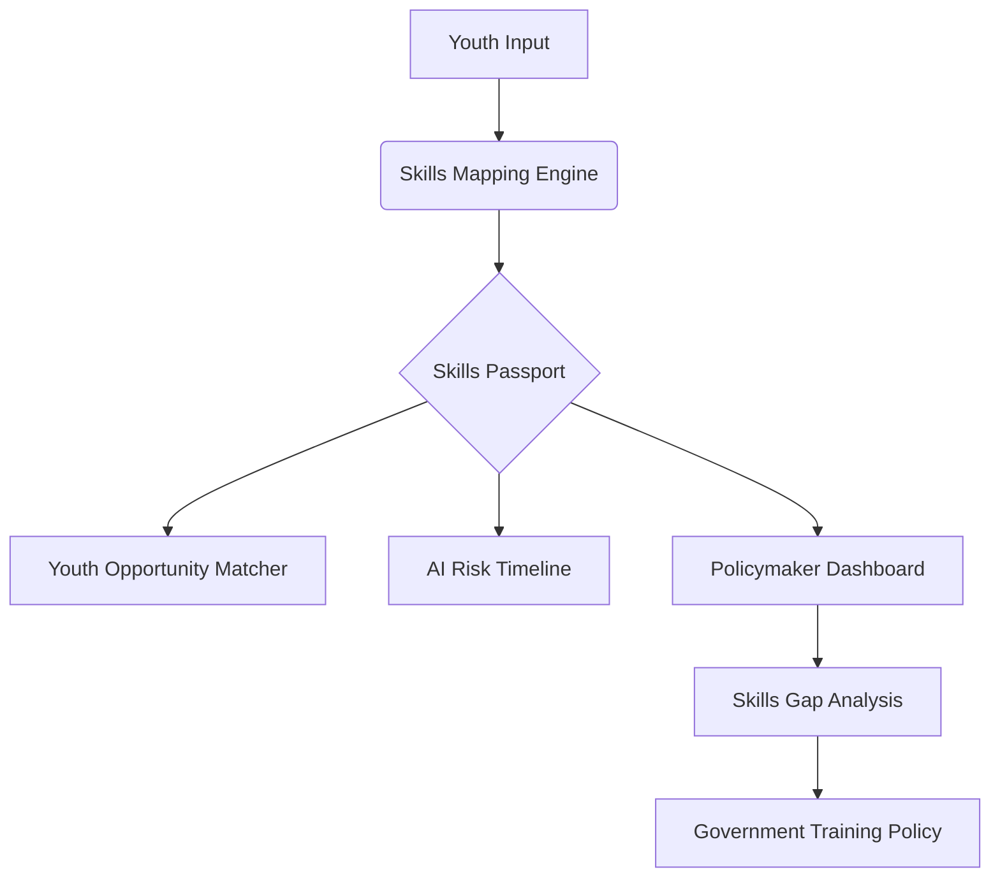

# 🛠️ UNMAPPED | Technical Workflow & Architecture

This document outlines the logical architecture, data processing pipelines, and infrastructure-first philosophy of the UNMAPPED platform.

---

## 🏗️ 1. Architectural Philosophy: "Protocol-First"
UNMAPPED is designed as a **portable infrastructure layer**. 
- **Separation of Concerns**: The UI and Business Logic are strictly separated from the **Country Configuration**.
- **Context Recalibration**: When a user switches contexts (e.g., Ghana ↔ India), the entire engine recalibrates its wage floors, sector classifications, and automation risk factors without a single line of code change.

---

## 🔄 2. Core User Workflows

### A. Skills Signal Engine (Taxonomy Mapping)
**Goal**: Transform informal experience into standardized signals.
1.  **Intake**: Natural language input (text/voice) from the youth user.
2.  **Extraction**: The engine filters keywords against a localized **SKILL_MAP**.
3.  **Standardization**: Matches keywords to **ISCO-08** and **ESCO** codes.
4.  **Generation**: Produces a "Skills Passport" with a unique Infrastructure ID and community vouch indicators.

### B. AI Readiness & Risk Lens (Calibration)
**Goal**: Honest automation assessment for the LMIC context.
1.  **Baseline**: Starts with **Frey-Osborne** automation probability scores.
2.  **Calibration**: Adjusts scores using the **Digital Penetration Factor** (from ITU data).
    *   *Logic*: High-risk tasks in a manual-intensive economy (e.g., phone repair in Accra) have a lower displacement speed than in highly automated economies.
3.  **Projection**: Integrates **Wittgenstein Centre** education data to show the durability of the user's skill set through 2035.

### C. Opportunity Matching (Econometric Signals)
**Goal**: Grounded, realistic matching.
1.  **Signal Surfacing**: Directly displays **Wage Floors** (ILOSTAT) and **Sector Growth** (WDI).
2.  **Filtering**: Matches the user's "Skills Passport" against reachable opportunities within a local commute radius.
3.  **Action**: Provides direct WhatsApp contact triggers, recognizing that LMIC matching happens via chat infrastructure.

---

## 📊 3. Data Infrastructure
UNMAPPED aggregates and surfaces signals from 4 primary tiers:
- **Labor Market**: ILOSTAT (Primary source for wages/employment).
- **Education**: ISCED 2011 classifications & UNESCO completing rates.
- **Automation**: Frey-Osborne & ILO Future of Work task indices.
- **Infrastructure**: ITU Digital Development indicators for digital readiness.

---

## 🛠️ 4. Technical Stack
- **Next.js 14+**: Server-side rendering for SEO and client-side transitions for UX.
- **Tailwind CSS v4**: Advanced obsidian design system with glassmorphism tokens.
- **Framer Motion**: Smooth-as-silk page transitions and micro-interactions.
- **Context API**: Global state management for real-time country reconfiguration.

---

## 🌍 5. Localization Workflow (Adding a Context)
To add a new country (e.g., Nigeria), a developer only needs to create a new config file in `src/lib/config/countries/nigeria.ts` following this schema:
```typescript
{
  id: 'nigeria',
  name: 'Nigeria',
  laborMarket: { dataSource: 'ILO ILOSTAT 2024', ... },
  automation: { digitalPenetration: 0.45, ... },
  education: { taxonomy: 'ISCED' },
  // ...
}
```
The UI will automatically detect the new context and recalibrate all logic.

---

## 📈 6. Impact Data Flow


## ⚖️ 7. Data Sovereignty & Privacy
For World Bank/Institutional deployment, UNMAPPED follows a **Privacy-by-Design** approach:
- **Local-First Storage**: User skill profiles are stored in the browser's local storage or exported as portable IDs, ensuring the user owns their data.
- **Anonymized Signal Aggregation**: Policymaker dashboards use anonymized, aggregated data to prevent the identification of individual youth workers in vulnerable informal sectors.
- **Incomplete Credentials**: By not requiring PII (Personal Identifiable Information) like full names or government IDs for basic mapping, we protect the most vulnerable workers.
